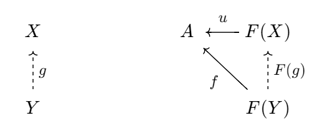

## 勉強する度に記憶を失う

### 挙句、勉強する度にノートを失くす

勉強する度に一からやり直しになる

おしまいみたいな状況

### 例: 普遍性ってなんだっけ……

### これだけ見ても分かるわけがない！

圏$\mathbf C$, $\mathbf D$, 関手$F: \mathbf C \to \mathbf D$を考えるとき、
Fから対象$A \in ob(\mathbf D)$への普遍射は、
$\mathbf C$の対象$X$と$D$の射$u: F(X) \to A$の対$(X, u)$であって、
$Y \in ob(\mathbf C)$と$f: F(Y) \to A$があったとき、常に$g: X \to Y$が一意に存在して、
$f = u \circ F(g)$を満たす。

## プログラミングの勉強なら

あちこちに大量のコード片を書き散らすので、なんとかなる

スマホ, PC, GitHub, Gist, etc.

### 記事も書いてる

[Algebraic Effects に触れてみたくて Koka に入門した](https://qiita.com/sparklingbaby/items/c819f3a88fe63341390f)

https://qiita.com/sparklingbaby/items/c819f3a88fe63341390f

## 圏論でも記録が必要そう

Zennでは本を書くことができるし、この機会に作ってみよう

### 作った

[圏論勉強ノート](https://zenn.dev/esnir/books/9595ef4f5dc413)

https://zenn.dev/esnir/books/9595ef4f5dc413

### 注意

- 教科書としての価値はない
- Awodey先生の[Category theory](https://www.amazon.co.jp/Category-Theory-Oxford-Logic-Guides/dp/0199237182/ref=sr_1_1?__mk_ja_JP=%E3%82%AB%E3%82%BF%E3%82%AB%E3%83%8A&crid=2FW8DUEUW50EH&keywords=category+theory&qid=1698500707&sprefix=category+theory%2Caps%2C152&sr=8-1)を買おう

## 雑感

- 本の書き心地は悪くはない
    - 一度公開してしまうと、下書きが書けなくなるのはややつらい
    - 可換図式を描けないのがつらい。Qiitaでは描けるのに
- 飽きて中断して、また一年後見返したときに理解できるかは謎

### 雑感

- 人に教えるつもりで書いていると、やはり理解が深まる気がする
    - 実際のノートだとただの走り書きになって、見返す意味が薄い
    - インターネットに公開することで、人に見せられるものを書こうという気持ちになる

### まとめ

- 勉強したことは、人に見せられる形で公開しよう
- Zennは複数の独立した内容を一冊の本にまとめられて嬉しい

