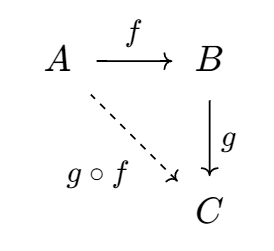

## 勉強する度に記憶を失う



### 挙句、勉強する度にノートを失くす

勉強する度に一からやり直しになる

おしまいみたいな状況

## 圏論に触れてみよう

### 例: 積

Javaの積 😄

```Java
class Pair<A, B> {
    public A a;
    public B b;
}
```

### 例: 積

Haskellの積 😊

```Haskell
(a, b)
```

### 例: 圏論の積 😇

$\mathbf C$を対象$X_1$, $X_2$を持つ圏とする。
$X_1$と$X_2$との積とは、$X_1 \times X_2$と書かれる$\mathbf C$の対象と二つの射$p_1: X_1 \times X_2 \to X_1$および$p_2: X_1 \times X_2 \to X_2$との組であって、
任意の対象$Y$と射$f_1: Y \to X_1$および$f_2: Y \to X_2$とが与えられたとき、一意な射$u: Y \to X_1 \times X_2$が常に存在して、
$f_1 = p_1 \circ u$かつ$f_2 = p_2 \circ u$を満たすものをいう。

## 例: 圏論の積(2)

積とは、図式$F: \mathbf 2 \to \mathbf C$の極限である。

### 極限とは

極限とは、添え字圏$\mathbf J$と図式$D: \mathbf J \to \mathbf C$を考えるとき、定関手$\Delta_L: \mathbf J \to \mathbf C$から図式$D$への自然変換$\eta: \Delta_L \Rightarrow D$で表される錐$(L, \eta)$であって、任意の錐$(N, \epsilon)$に対して一意な射$u: N \to L$が常に存在して、$\mathbf J$の任意の対象$X$に対して$\epsilon_X = \eta_X \circ u$を満たすものである。

## 例: 圏論の積(3)

積とは、対角関手$\Delta: \mathbf C \to \mathbf C \times \mathbf C$から$\mathbf C \times \mathbf C$の対象$(X_1, X_2)$への普遍射である。

### 普遍射とは

圏$\mathbf C$, $\mathbf D$, 関手$F: \mathbf C \to \mathbf D$を考えるとき、
Fから対象$A \in ob(\mathbf D)$への普遍射は、
$\mathbf C$の対象$X$と$D$の射$u: F(X) \to A$の対$(X, u)$であって、
$Y \in ob(\mathbf C)$と$f: F(Y) \to A$があったとき、常に$g: X \to Y$が一意に存在して、
$f = u \circ F(g)$を満たす。

## プログラミングの勉強なら

あちこちに大量のコード片を書き散らすので、なんとかなる

スマホ, PC, GitHub, Gist, etc.

### 記事も書いてる

[Algebraic Effects に触れてみたくて Koka に入門した](https://qiita.com/sparklingbaby/items/c819f3a88fe63341390f)

https://qiita.com/sparklingbaby/items/c819f3a88fe63341390f

## 圏論でも記録を付けたい

Zennでは本を書くことができるし、この機会に作ってみよう

### 作った

[圏論勉強ノート](https://zenn.dev/esnir/books/9595ef4f5dc413)

https://zenn.dev/esnir/books/9595ef4f5dc413

### 注意

- 教科書としての価値はない
- Awodey先生の[Category theory](https://www.amazon.co.jp/Category-Theory-Oxford-Logic-Guides/dp/0199237182/ref=sr_1_1?__mk_ja_JP=%E3%82%AB%E3%82%BF%E3%82%AB%E3%83%8A&crid=2FW8DUEUW50EH&keywords=category+theory&qid=1698500707&sprefix=category+theory%2Caps%2C152&sr=8-1)を買おう

## 雑感

- 本の書き心地は悪くはない
    - スマホで書きづらい
    - 一度公開してしまうと、下書きが書けなくなる
    - 可換図式を描けないのがつらい
- 飽きて中断して、また一年後見返したときに理解できるかは謎

### 雑感

- 人に教えるつもりで書いていると、やはり理解が深まる気がする
    - 実際のノートだとただの走り書きになって、見返す意味が薄い
    - インターネットに公開することで、人に見せられるものを書こうという気持ちになる

### まとめ

- 勉強したことを、人に見せられる形で公開すると、自身の理解をより深めることができる
- Zennは複数の独立した内容を一冊の本にまとめられて嬉しい

